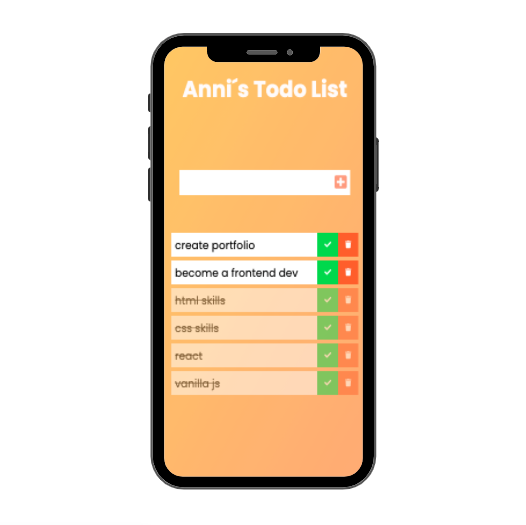

# to-do-list 

> Small project using vanilla js

### Design

You can view the app here:
[Demo Version in Vercel](https://to-do-list-one-teal.vercel.app/)

## `Tech Stack`

- HTML
- CSS
- Vanilla JavaScript
- Git Workflow
- Vercel

## `Project setup`

1. Clone this repository.
2. To run the app in development mode `npx serve`, then open http://localhost:5000 to view it in the browser
